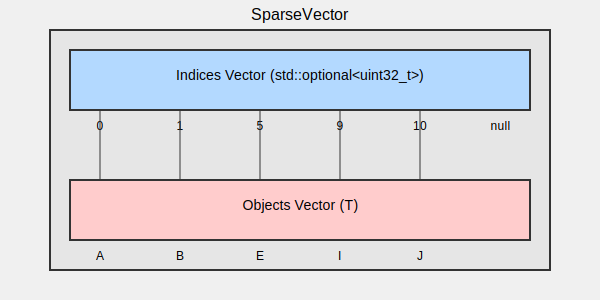

# SparseVector

## Overview

The `SparseVector` is a custom container designed for efficient storage and management of sparse data, where only a small subset of possible indices contains actual values.

## Key Features

- Combines fast random access (like a vector) with memory efficiency (like a map)
- O(1) access time for elements
- Memory usage proportional to the number of stored elements, not the highest index

## Internal Structure
  

- Uses two internal vectors:
    1. A vector to store the actual data objects (pink rectangle)
    2. A vector to maintain a mapping between sparse indices and positions in the data vector (blue rectangle)
 
- The Indices Vector uses std::optional<uint32_t> to map sparse indices to positions in the Objects Vector, which stores the actual data of type T. In the example, sparse indices 0, 1, 5, 9, and 10 are mapped to objects A, B, E, I, and J respectively, with arrows indicating these connections

## Supported Operations

- Standard container operations (insertion, deletion, iteration)
- Vector-like indexing
- Custom iterator that skips over empty indices

## Use Cases

Ideal for scenarios involving large, sparsely populated datasets, offering:
- Better performance than a map for random access
- More memory-efficient than a standard vector for sparse data

## Performance Characteristics

- Insertion: O(1) average case
- Deletion: O(1) average case
- Access: O(1)
- Iteration: O(n), where n is the number of non-empty elements

## Memory Efficiency

Only allocates memory for existing elements, making it highly efficient for sparse datasets with large index ranges.

## Benchmarks

```
Vector add time: 2016 microseconds
Vector read time: 2 microseconds
Vector size: 10000 elements
Vector detailed memory usage:
  Vector capacity: 10000 elements
  Vector size: 10000 elements
  Total optional<LargeObject> size: 390.62 KB
  Number of actual LargeObjects: 1000
  Total LargeObject size: 78398.44 KB
  Total memory usage: 78789.06 KB

Map add time: 2567 microseconds
Map read time: 50 microseconds
Map size: 1000 elements
Map memory usage: 7843.75 KB

Unordered Map add time: 2232 microseconds
Unordered Map read time: 10 microseconds
Unordered Map size: 1000 elements
Unordered Map memory usage: 7843.75 KB

Sparse Vector add time: 2292 microseconds
Sparse Vector read time: 3 microseconds
Sparse Vector size: 1000 elements
Sparse Vector detailed memory usage:
  Objects vector size: 8028.00 KB
  Indices vector size: 134.39 KB
  Total memory usage: 8162.39 KB


```